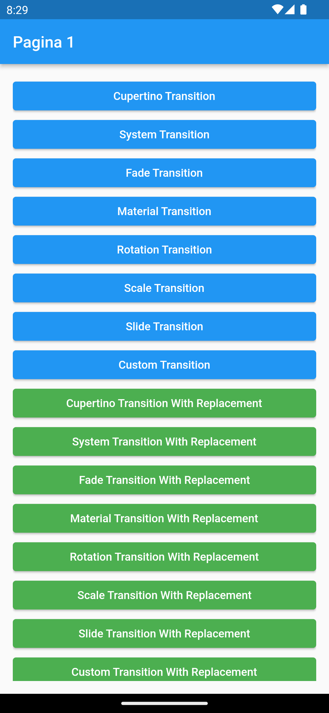
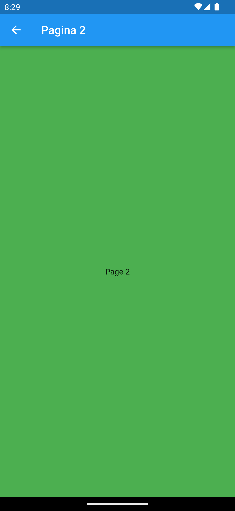
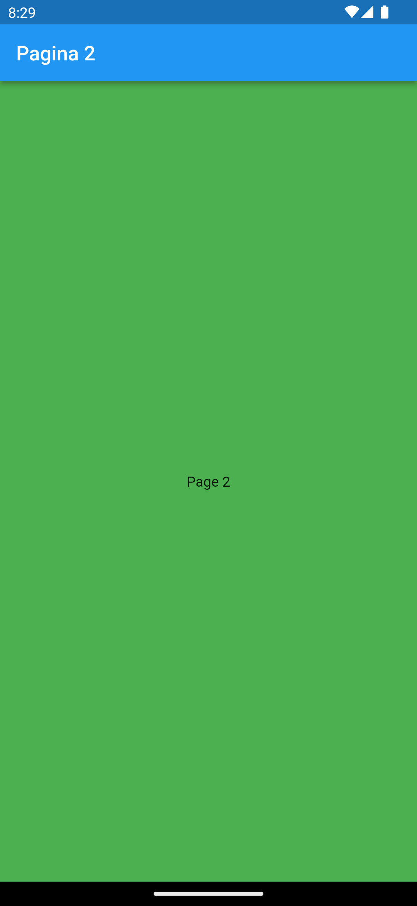
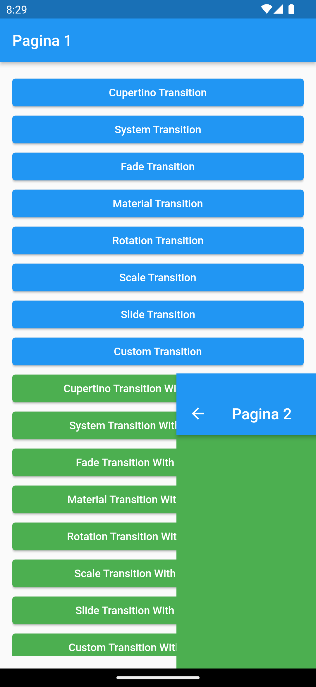
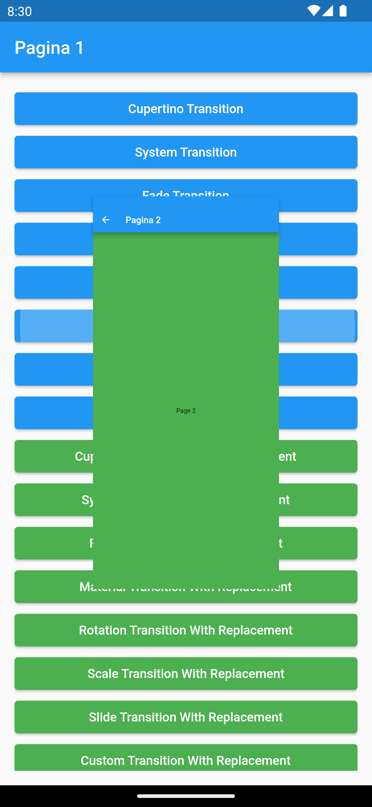

# Transitions app

This application is a tool that allows you to visualize and experiment with the different screen transitions that can be done in flutter.

The application has custom classes created specifically to facilitate the use of these transitions, making it very easy to use. Also, transitions can be adjusted to the user's tastes or can be set in the app theme for a more personalized experience.

The application is well prepared and documented, making it suitable for future use as a package on pub.dev.

  
  
  
  
  

